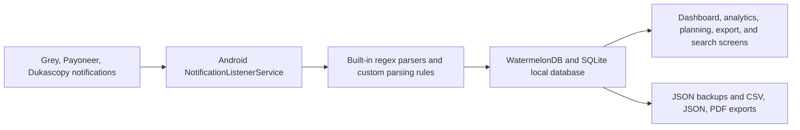

<p align="center">
  
</p>

<p align="center">
  
</p>

<h1 align="center">WalletPulse</h1>

<p align="center">
  <strong>Android-only, offline-first expense tracking for multi-currency users.</strong>
</p>

<p align="center">
  WalletPulse turns supported bank and fintech notifications into structured transactions, then helps you
  organize spending with wallets, budgets, goals, subscriptions, reminders, analytics, exports, and backups,
  all stored locally on your device.
</p>

<p align="center">
  
  
  
  
  
  
  
</p>

## Why WalletPulse

- **Automatic capture**: Parse supported Android notifications from Grey, Payoneer, and Dukascopy into structured transactions.
- **Offline by default**: Store data locally with WatermelonDB and SQLite, with no backend dependency for core usage.
- **Built for multi-currency money flows**: Track wallets by currency, cache FX rates locally, and convert between 150+ currencies.
- **Real financial planning**: Manage budgets, savings goals, subscriptions, bill reminders, and transaction templates in one app.
- **Operator-grade controls**: Search, filter, export to CSV/JSON/PDF, review notification logs, and create full-device backups.

## Supported Financial Apps

<table>
  <tr>
    <td align="center" width="33%" bgcolor="#111111">
      
    </td>
    <td align="center" width="33%">
      
    </td>
    <td align="center" width="33%">
      
    </td>
  </tr>
  <tr>
    <td align="center"><strong>Grey</strong></td>
    <td align="center"><strong>Payoneer</strong></td>
    <td align="center"><strong>Dukascopy</strong></td>
  </tr>
  <tr>
    <td align="center">Capture supported transfers, card activity, and balance events from Grey notifications.</td>
    <td align="center">Parse incoming and outgoing Payoneer activity directly from Android push notifications.</td>
    <td align="center">Log supported Dukascopy banking activity without manual copy and paste.</td>
  </tr>
</table>

Built-in parser support currently targets:

- `com.grey.android`
- `com.payoneer.android`
- `com.dukascopy.bank`

Custom parsing rules are also available for additional apps that do not yet have a built-in parser.

## How It Works



## Current Capabilities

### Capture and Review

- Automatic transaction parsing for supported providers
- Manual transaction entry and editing
- Transaction templates for recurring or repetitive entries
- Receipt attachments and full-screen receipt viewing
- Notification log for parser debugging and traceability
- Full-text search with filters for date, amount, wallet, category, and tags

### Multi-Currency

- Multi-wallet setup with one wallet per currency
- Base currency conversion across dashboards and analytics
- ExchangeRate-API integration with local FX caching
- Built-in currency converter for 150+ currencies
- Integer-cent amount storage to avoid floating-point drift

### Planning and Control

- Category budgets with progress tracking
- Savings goals with milestone progress
- Subscription tracking for recurring costs
- Bill reminders with due-date alerts
- Parsing rules for unsupported apps
- PIN lock flow for local app access control

### Export and Resilience

- Export transactions as CSV, JSON, or PDF
- Share exports directly from the device
- Create full JSON backups to the Downloads folder
- Restore the app from a backup file
- All core data stays on-device and is never sent to your own backend

## Tech Stack

| Area | Stack |
|:---|:---|
| App | React Native `0.84.1` |
| Language | TypeScript (strict mode) + Kotlin for Android-native integration |
| Storage | WatermelonDB with SQLiteAdapter |
| Navigation | React Navigation 7 |
| State | Zustand + WatermelonDB observables |
| Charts | `react-native-gifted-charts` |
| Animations | `react-native-reanimated` |
| Icons | `react-native-vector-icons` + custom brand icons |
| Export | CSV, JSON, and PDF generation |
| FX Rates | ExchangeRate-API with local caching |
| Testing | Jest + `@testing-library/react-native` |

## Architecture

```text
src/
├── domain/          # Entities, value objects, use cases, repository interfaces
├── data/            # WatermelonDB models, repositories, mappers, local data access
├── presentation/    # 30+ screens, components, hooks, stores, navigation
├── infrastructure/  # Notification listeners, parsers, export, backup, native bridges
├── shared/          # Theme, constants, utilities, shared types
└── app/             # Application entry and providers
```

Dependency rule:

```text
Presentation  -->  Domain  <--  Data
                     ^
                     |
               Infrastructure
```

The domain layer stays framework-free. Data and infrastructure depend on domain contracts. Presentation consumes the app through hooks, stores, and use cases.

## Getting Started

### Prerequisites

| Tool | Version |
|:---|:---|
| Node.js | `22.11.0+` |
| Java | `17` |
| Android Studio | Android SDK `34` |
| Device / Emulator | Android `API 26+` |

### Installation

```bash
git clone https://github.com/kika1s1/WalletPulse.git
cd WalletPulse
npm install
cp .env.example .env
```

Add your ExchangeRate-API key to `.env`:

```bash
FX_API_KEY=your_api_key_here
```

Get a free key from [ExchangeRate-API](https://www.exchangerate-api.com/).

### Run the App

```bash
npm start
npm run android
```

### Quality Checks

```bash
npm test
npm run typecheck
npm run lint
npm run check
```

## Android Setup Notes

After launching the app for the first time:

1. Create or confirm your base wallet and currency.
2. Enable the notification listener during onboarding or later from Settings.
3. Send or wait for a supported notification from Grey, Payoneer, or Dukascopy.
4. Review parsed results in the dashboard or Notification Log.

Relevant Android capabilities used by the app:

| Permission / Capability | Purpose |
|:---|:---|
| `BIND_NOTIFICATION_LISTENER_SERVICE` | Read supported financial notifications |
| `FOREGROUND_SERVICE` | Keep the listener service available |
| `INTERNET` | Refresh FX rates |
| Download directory access | Save backups and export files |

## Documentation

| Document | Description |
|:---|:---|
| [Product Requirements](docs/PRD.md) | Feature scope and acceptance criteria |
| [Architecture](docs/ARCHITECTURE.md) | Clean Architecture layers and data flow |
| [Database Schema](docs/DATABASE_SCHEMA.md) | Database tables and fields |
| [Notification Parsing](docs/NOTIFICATION_PARSING.md) | Parser strategy and regex approach |
| [API Reference](docs/API_REFERENCE.md) | Use cases, repositories, and hooks |
| [Tech Stack](docs/TECH_STACK.md) | Dependency decisions and rationale |
| [Development Guide](docs/DEVELOPMENT_GUIDE.md) | TDD workflow and implementation phases |

## Roadmap

Planned items that are not positioned as fully shipped in this README:

- Biometric unlock
- Optional encrypted local database
- More built-in financial app parsers
- Additional onboarding and platform polish

## Development Conventions

- Follow red, green, refactor TDD workflow
- Store money as integer cents
- Store dates as Unix timestamps in milliseconds
- Keep notification parsers pure and deterministic
- Use named exports for components and default exports for screens
- Keep domain logic independent from framework code

<p align="center">
  <sub>Grey, Payoneer, and Dukascopy names and logos are property of their respective owners.</sub>
</p>
